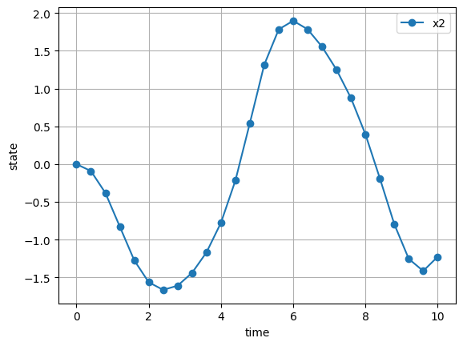
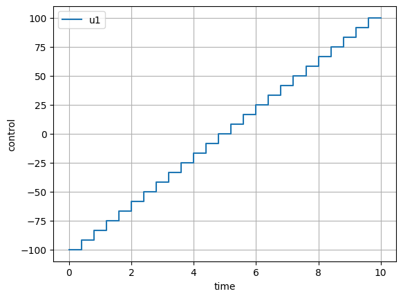
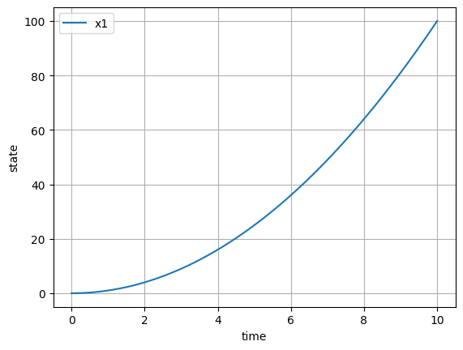
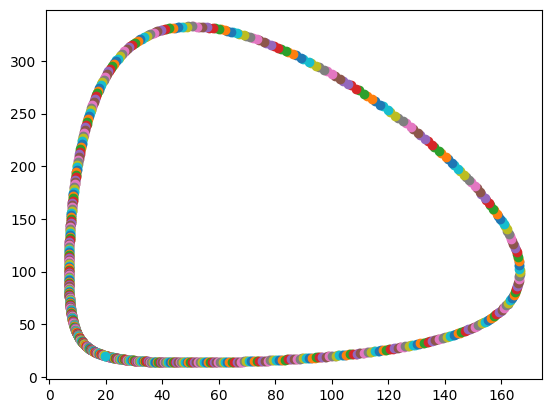

# Simulate

Using simulatetraj, initial value problems can be solved numerically. In the backend, an adaptive numerical integration is performed using CVODES from the SUNDIALS suite.

Given initial state $x(t_0)=x_0$ and control inputs $u(t)$ on $t \in [t_0,t_f]$, the state trajectory $x(t)$ is computed for the explicit differential equation $\dot{x}=f(x,u,t,p)$.

|Symbol|Description|Dimensions|
|-|-|-|
|$x(t)$|State vector| $\mathbb{R}^{n_x}$|
|$u(t)$|Control vector| $\mathbb{R}^{n_u}$|
|$p$|Parameter vector| $\mathbb{R}^{n_p}$|
|$t$|time| $\mathbb{R}^{1}$|

## Dependencies

* ```casadi==3.6.4```
* ```matplotlib==3.8.2```
* ```numpy==```

## Installation

At the moment, the package is tested and run on Windows 10.

* Clone the repository or download zip
* Open the folder with VScode

### venv

* Create virtual environment using venv
* All dependencies and package will be installed automatically

### conda

* create conda environment with python >=3.1
* type ``` pip install poetry```
* from the directory containing the toml file, type ``` poetry install```
* all dependencies and package will be installed

Run the python notebooks from examples folder to verify the installation.

## Limitations

* casadi based limitaions apply

## Usage

Consider the initial value problem given below where the behaviour of the
system is studied with respect to given set of inputs and initial condition.
Lets make it parameteric by adding a scalar parameter to the ode and setting its value to zero.

### ODE 1

$$
\begin{aligned}
(t_0,t_f,N)&=(0,10,25)\\
x(t_0)&=\begin{bmatrix}
0\\
0
\end{bmatrix}
\\
u(t)&=0.2t-1\\
p&=0\\
\begin{bmatrix}
    \dot{x}_0\\
    \dot{x}_1
\end{bmatrix}&=
\begin{bmatrix}
    (1-x_1^2)x_0-x_1+u\\
    x_0
\end{bmatrix}+p
\end{aligned}
$$

The problem can be solved in 2 ways using Simulate.

1. eliminate controls from the ode
2. supply controls evaluated on the grid points

#### Elimination

Define the number of states and parameter by calling the constructor of the Simulate class. Both the methods are equivalent. Skipping an argument simply sets it to zero.

```python
a=Simulate(n_x=cs.MX(2),n_p=cs.MX(1))
```

```python
a=Simulate(n_x=cs.MX(2),n_u=cs.MX(0),n_p=cs.MX(1))
```

Once the states, controls and parameters are defined, set the numerical grid for integration. The state vector will be computed at these time points. tini, tfin and N are the initial time, final time and number of intervals, respectively.

```python
a.set_grid(tini=cs.MX(0),tfin=cs.MX(10),N=cs.MX(25))
```

The Simulate class has symbolic attributes for the state, control and parameter vector (t,x,u,p) which can be used to define the dynamics of the system. These are MX symbolics offered by casadi. If nonlinear functions like trignometric function are to be applied, they must be imported from the casadi namespace.

```python
f=cs.vertcat((1-a.x[1]**2)*a.x[0]-a.x[1]+0.2*a.t-1,a.x[0])+a.p
a.set_ode(f)
```

Set the initial condition and parameter value and solve the initial value problem. t is the time grid and a.r['xf'] has the state values at the grid point except for the initial time.

```python
x0=cs.DM([0,0])
a.start(X0=cs.horzcat(x0),P=cs.DM(0))
r=a.r
t=a.t_grid
```

Plot the state and control time histories.

```python
a.plot_sol()
```




#### without control elimination

The control input is approximated as a piecewise constant function.

```python
a=Simulate(n_x=cs.MX(2),n_u=cs.MX(1),n_p=cs.MX(1))
a.set_grid(cs.MX(0),cs.MX(10),cs.MX(25))
f=cs.vertcat((1-a.x[1]**2)*a.x[0]-a.x[1]+a.u,a.x[0])+a.p
a.set_ode(f)
x0=cs.DM([0,0])
a.start(X0=cs.horzcat(x0),U=cs.linspace(-1,1,25).T,P=cs.DM(0))
r=a.r
t=a.t_grid
a.plot_sol()
```




### $t^2$

$$
\begin{aligned}
(t_0,t_f,N)&=(0,10,100000)\\
x(t_0)&=0\\
\dot{x}&=2t
\end{aligned}
$$

```python
b=Simulate(cs.MX(1))
b.set_grid(tini=cs.MX(0),tfin=cs.MX(10),N=cs.MX(100000))
f=2*b.t
b.set_ode(f)
x0=cs.DM([0])
b.start(x0)
b.plot_sol()
print('Global error x(N+1) for xdot=2t:',cs.evalf(b.r['xf'][-1]-100))
```

```bash
Global error x(N+1) for xdot=2t: 0.0016011
```



The default values for cvodes is 0.001 and 0.1 for absolute and relative tolerance, respectively. By increasing the tolerance global error can be reduced.

```python
 b.start(x0,tol=1e-12)
```

```bash
Global error x(N+1) for xdot=2t: 4.81748e-12
```

### Lotka voltera/prey-predator model

$$
\begin{aligned}
(t_0,t_f,N)&=(0,15,1000)\\
(\alpha,\beta)&=(0.01,0.02)\\
x(t_0)&=\begin{bmatrix}
    20\\
    20
\end{bmatrix}\\
\begin{bmatrix}
    \dot{x}_0\\
    \dot{x}_1
\end{bmatrix}&=
\begin{bmatrix}
    x_0-\alpha x_0 x_1\\
    -x_1+\beta x_0 x_1
\end{bmatrix}
\end{aligned}
$$

```python
d=Simulate(n_x=cs.MX(2),n_p=cs.MX(2))
d.set_grid(cs.MX(0),cs.MX(15),cs.MX(1000))
f=cs.vertcat(d.x[0]-d.p[0]*d.x[0]*d.x[1],-d.x[1]+d.p[1]*d.x[0]*d.x[1])
d.set_ode(f)
x0=cs.DM([20,20])
p=cs.DM([0.01,0.02])
d.start(X0=x0,P=p,tol=1e-8)
#d.plot_sol()
plt.plot(cs.evalf(d.r['xf'][0,:]),cs.evalf(d.r['xf'][1,:]),'o')
plt.show()
```



## Advanced

The integrator class can be used in conjunction with *trajectory optimization*, where the symbolic primitives can be passed for initial state and control inputs. This can be embedded in an optimization problem and solved for the optimal control input vector. See examples folder where single and multiple shooting methods have been implemented and solved.

```python
c=Simulate(cs.MX(1),cs.MX(1))
c.set_grid(cs.MX.sym('tf',1,1),cs.MX.sym('tf',1,1),cs.MX(10))
f=2*c.t+c.u
c.set_ode(f)
x0=cs.DM([0])
c.start(x0,cs.MX.sym('u',1,10))  
```
